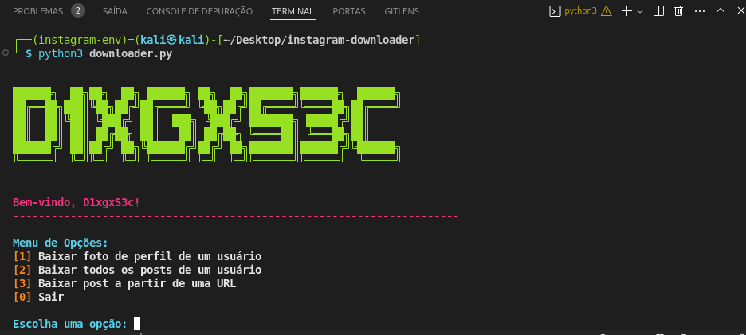

# instaPegador


## Descrição
`instaPegador` é uma ferramenta Python que permite baixar fotos de perfil, posts e vídeos do Instagram. Utiliza a biblioteca `instaloader` para realizar essas operações de forma eficiente e simples.

## Funcionalidades
- **Baixar Foto de Perfil**: Baixa a foto de perfil de um usuário específico.
- **Baixar Todos os Posts**: Baixa todos os posts públicos de um usuário.
- **Baixar Post por URL**: Baixa um post específico a partir de uma URL.

## Requisitos
- Python 3.x
- Biblioteca `instaloader`

## Instalação
1. Clone o repositório:
   ```sh
   git clone https://github.com/D1xgxS3c/instaPegador.git
   cd instaPegador

2. Crie um ambiente virtual e ative-o:
   ```sh
   python3 -m venv instagram-env
   source instagram-env/bin/activate

3. Instale as dependências:
   ```sh
   pip install instaloader

4. Torne o script executável:
   ```sh
   chmod +x downloader.py

## Uso

5. Para executar o script, utilize o comando:
   ```sh
   python3 ./downloader.py

## Menu de Opções 

6. Para executar o script, utilize o comando:
     ```sh
    1 -  Baixar foto de perfil de um usuário

    2 -  Baixar todos os posts de um usuário
  
    3 -  Baixar post a partir de uma URL
  
    0 -  Sair

## Exemplos


7.  Baixar Foto de Perfil
 
      ```sh
    1 - python3 ./downloader.py
    usuario

8.  Baixar Todos os Posts
    
      ```sh
    2 - python3 ./downloader.py
    usuario

9.  Baixar Post por URL

      ```sh
    3 - python3 ./downloader.py
    "https://www.instagram.com/p/Ba5dQtcjN9M/"

## Licença

    Este projeto está licenciado sob a Licença MIT - veja o arquivo LICENSE para mais detalhes.

    Autor
    Desenvolvido por D1xgxS3c.

Contato: [Instagram](https://www.instagram.com/D1XGXS3C/#)  


    